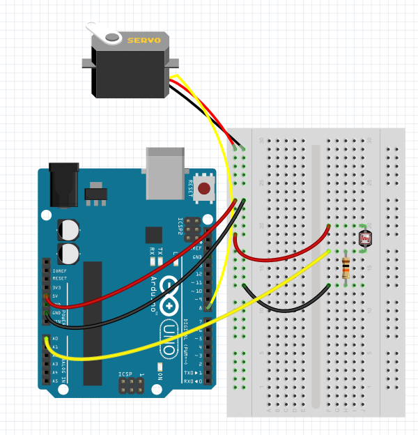

# Build a "High 5" Robotic Arm
In this project, you will be using a servo to move a robotic arm. A photo resistor will trigger the servo, so that when a shadow of a hand passes over the photo resistor, the arm rotates into a "high 5" position.

### Step 1: Build the circuit
Our Robotic Arm circuit will use the following parts:
- Servo with popsicle stick hand
- 10KΩ resistor
- Photoresistor
- Jumper wires   

Use the pictures from the previous project to make sure you are using correct 10KΩ resistor and photoresistor   

Use the following circuit diagram to construct the circuit. The direction of the photoresistor and the 10KΩ resistor is unimportant.   

### Step 2: Test the circuit
Just like in the previous project, you can test the photoresitor of your circuit by using your hand to create a shadow over the photoresistor. A shadow should decrease the the value of the Analog0 sensor. You can display the value in a say block or just look at Analog0 in the sensors display.   

To test the servo    
TBD
### Step 3: Build the Robotic Arm
There may already be a popsicle arm in your kit. If not, you will need to create one.

TBD

### Step 4: Write the program
TBD

### Step 5: Submit your finished program
Have your teacher or a TA verify that you have a working program. Submit your finished program by uploading the .sb file to Google classroom. You should be able to find it in *My Documents | Scratch Projects*. If you worked with a partner, each partner should submit a copy of the finished program to Google classroom.
